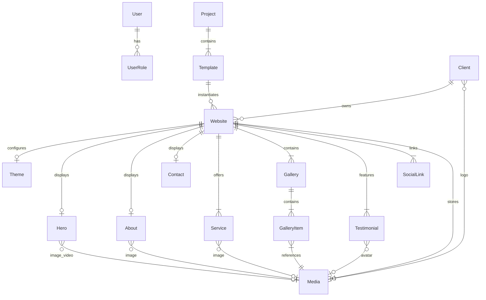

# Database Schema & Entity Relationships

The Emperor Smart Solutions database runs on **PostgreSQL 16** managed via **Prisma ORM**.

---

## 1. Entity-Relationship Diagram



---

## 2. Enums

### `UserRole`
- `ADMIN`: Full administrative privileges (can create/delete templates, projects, and manage staff).
- `STAFF`: Read-only or standard operational privileges.

### `ClientStatus`
- `ACTIVE`: Active client.
- `INACTIVE`: Temporarily inactive client.
- `ARCHIVED`: Archived client record.

### `WebsiteStatus`
- `DRAFT`: In-development or unreleased website.
- `PUBLISHED`: Publicly active and accessible website.
- `ARCHIVED`: Archived website.

### `MediaType`
- `IMAGE`: PNG, JPEG, WebP, SVG.
- `VIDEO`: MP4, WebM.
- `DOCUMENT`: PDF, DOCX.

### `SocialPlatform`
- `INSTAGRAM`, `FACEBOOK`, `YOUTUBE`, `LINKEDIN`, `TWITTER`, `WHATSAPP`, `OTHER`.

---

## 3. Data Models Specification

### 3.1 `User`
Manages platform administrators and staff.
```prisma
model User {
  id           String   @id @default(uuid())
  name         String
  email        String   @unique
  passwordHash String
  role         UserRole @default(STAFF)
  isActive     Boolean  @default(true)
  createdAt    DateTime @default(now())
  updatedAt    DateTime @updatedAt
}
```

### 3.2 `Project` & `Template`
Defines agency projects and reusable website template specifications.
```prisma
model Project {
  id          String     @id @default(uuid())
  name        String
  slug        String     @unique
  description String?
  isActive    Boolean    @default(true)
  templates   Template[]
  createdAt   DateTime   @default(now())
  updatedAt   DateTime   @updatedAt
}

model Template {
  id           String    @id @default(uuid())
  projectId    String
  project      Project   @relation(fields: [projectId], references: [id], onDelete: Cascade)
  name         String
  slug         String
  templateKey  String    // e.g. "aurora-corporate", "template-01"
  description  String?
  previewImage String?
  isActive     Boolean   @default(true)
  websites     Website[]
  createdAt    DateTime  @default(now())
  updatedAt    DateTime  @updatedAt

  @@unique([projectId, templateKey])
}
```

### 3.3 `Client` & `Website`
Represents client organizations and customized deployed websites.
```prisma
model Client {
  id           String       @id @default(uuid())
  businessName String
  slug         String       @unique
  description  String?
  logoMediaId  String?
  logoMedia    Media?       @relation("ClientLogo", fields: [logoMediaId], references: [id], onDelete: SetNull)
  phone        String?
  email        String?
  address      String?
  city         String?
  state        String?
  country      String?
  status       ClientStatus @default(ACTIVE)
  websites     Website[]
  createdAt    DateTime     @default(now())
  updatedAt    DateTime     @updatedAt
}

model Website {
  id          String        @id @default(uuid())
  clientId    String
  client      Client        @relation(fields: [clientId], references: [id], onDelete: Restrict)
  templateId  String
  template    Template      @relation(fields: [templateId], references: [id], onDelete: Restrict)
  name        String
  slug        String        @unique
  status      WebsiteStatus @default(DRAFT)
  isPublished Boolean       @default(false)
  publishedAt DateTime?

  theme        Theme?
  hero         Hero?
  about        About?
  contact      Contact?
  services     Service[]
  galleries    Gallery[]
  media        Media[]       @relation("WebsiteMedia")
  testimonials Testimonial[]
  socialLinks  SocialLink[]

  createdAt DateTime @default(now())
  updatedAt DateTime @updatedAt
}
```

### 3.4 CMS Content & Theme Models
Each `Website` can have individual content records:

| Model | Relationship | Description |
| :--- | :--- | :--- |
| `Theme` | `Website` 1-to-1 (`onDelete: Cascade`) | Colors (`primary`, `secondary`, `accent`, `bg`, `text`), fonts (`heading`, `body`), button styles, layout styles, and presets. |
| `Hero` | `Website` 1-to-1 (`onDelete: Cascade`) | Eyebrow, Title, Description, CTA Buttons, Hero Image & Video. |
| `About` | `Website` 1-to-1 (`onDelete: Cascade`) | Eyebrow, Title, Description, Image. |
| `Service` | `Website` 1-to-Many (`onDelete: Cascade`) | Title, Short Description, Full Description, Icon, Image, Sort Order. |
| `Gallery` & `GalleryItem` | `Website` 1-to-Many (`onDelete: Cascade`) | Title, Description, Media items with sort order. |
| `Testimonial` | `Website` 1-to-Many (`onDelete: Cascade`) | Reviewer Name, Role, Company, Review text, Avatar Media, Sort Order. |
| `Contact` | `Website` 1-to-1 (`onDelete: Cascade`) | Email, Phone, WhatsApp, Address, City, State, Country, Google Map URL. |
| `SocialLink` | `Website` 1-to-Many (`onDelete: Cascade`) | Platform enum, URL, Sort Order. |
| `Media` | `Website` 1-to-Many (`onDelete: Cascade`) | Storage key, URL, MIME type, file size, dimensions, alt text. |

---

## 4. Cascading & Deletion Integrity Rules

1. **Client Deletion Protection**: `Website` has `onDelete: Restrict` for `Client` and `Template`. A client or template cannot be deleted while active websites reference it.
2. **Website Cascade Deletion**: Deleting a `Website` automatically cascades and deletes all associated `Theme`, `Hero`, `About`, `Contact`, `Services`, `Galleries`, `Testimonials`, and `SocialLinks`.
3. **Media Nullification**: Deleting a `Media` record safely sets foreign keys (`imageId`, `logoMediaId`, `avatarMediaId`) to `NULL` (`onDelete: SetNull`) to avoid breaking UI layout trees.
